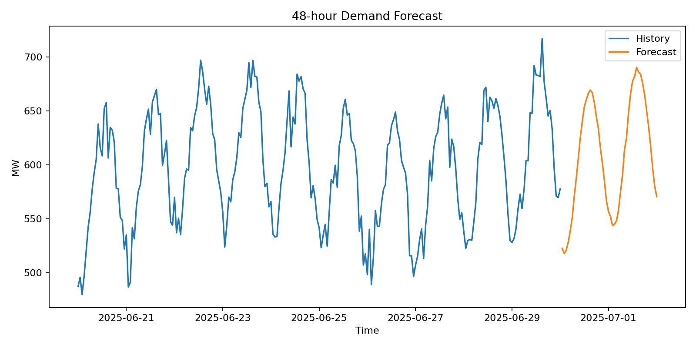
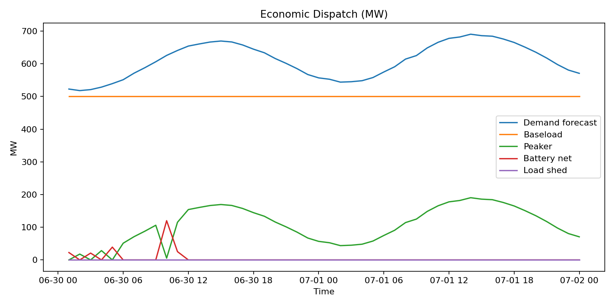
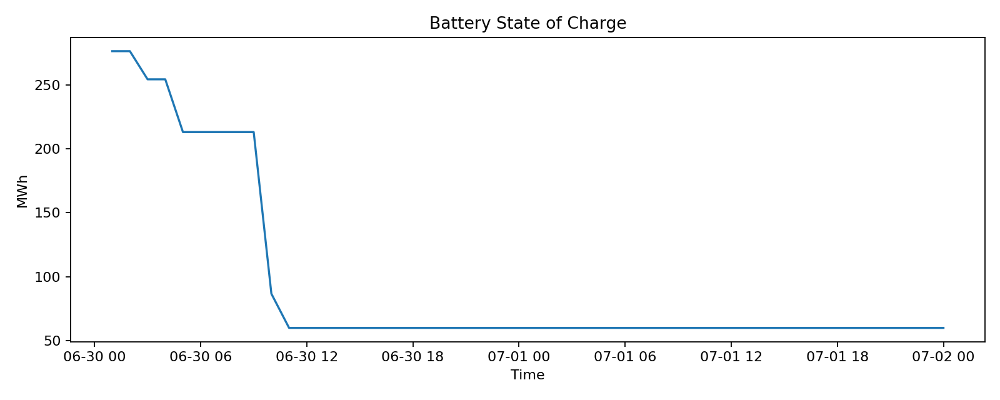

# AI-Driven Energy Demand Forecasting & Economic Dispatch Optimization

This project combines **deep learning time-series forecasting** with **operations research optimization** to tackle a realistic energy grid scheduling problem.

It predicts **48 hours** of electricity demand using a **PyTorch LSTM** and then solves an **economic dispatch problem** that schedules:
- A **baseload generator** (low-cost, slow to adjust)
- A **peaker plant** (high-cost, flexible)
- A **battery energy storage system (BESS)** (bidirectional power flow with efficiency losses)

The optimizer minimizes generation costs while respecting:
- Generator capacity limits
- Ramping constraints for baseload
- Battery charging/discharging limits and efficiencies
- State of charge bounds

If demand exceeds physical capacity, a **load-shedding slack** variable (with a large penalty) ensures feasibility while signaling unmet load.

---

## 📜 Project Context

This was a **summer project** I undertook to push myself beyond just “making something that works.”  
I wanted the **final code to feel professional and deployment-ready**, so I included:
- A modular **pipeline structure**
- Clear **VS Code debug/run tasks**
- Automated **data loading, model training, forecasting, optimization, and plotting**
- Configurable parameters and CLI flags for real-world flexibility

The goal was to simulate **what a real implementation might look like in an industry setting** while still keeping it approachable as a portfolio project.

---

## 🔍 Key Features

**AI Forecasting**
- Model: PyTorch `nn.LSTM` with MLP output head
- Input features:
  - Historical demand & temperature
  - Hour/day-of-week cyclic encodings
- Direct multi-horizon output (predicts all future hours in one shot)
- Configurable horizon (default: 48h) and training window length

**Optimization**
- Linear program formulated and solved with SciPy’s HiGHS solver
- Objective: Minimize total cost = baseload cost + peaker cost + battery cycling cost + (optional) load-shedding penalty
- Auto-scales generation capacities based on forecast demand

**Visualization**
- **Forecast plot**: Historical demand + LSTM forecast
- **Dispatch plot**: Optimal schedule for baseload, peaker, battery, and any load shed
- **State of Charge (SOC) plot**: Battery SOC profile across the forecast horizon

---

## Example Results

### Forecast (48h)

### Optimal Dispatch

### Battery State of Charge

---

## Results Interpretation

**Forecast plot** – Shows the LSTM's predicted demand curve over the next 48 hours, overlaid on recent historical demand. The model captures daily demand cycles and temperature effects.

**Dispatch plot** – Breaks down how the optimizer schedules each asset to meet demand:
- **Baseload** runs steadily near its optimal output.
- **Peaker** fills short-term gaps or spikes in demand.
- **Battery** charges during low-cost surplus and discharges during peaks.
- **Load shed** appears only if demand exceeds total capacity — a signal of physical constraint violations.

**SOC plot** – Tracks the battery’s state of charge over the forecast horizon. Shows how the optimizer strategically uses storage to shift energy from low-demand to high-demand hours.

---

## Project Structure
.
├── data/ # Simulated hourly demand + temperature CSV
├── reports/
│ ├── figures/ # Plots: forecast.png, dispatch.png, soc.png
│ └── forecast_48h.csv # Forecast data
│ └── dispatch_48h.csv # Dispatch schedule
├── src/
│ ├── main.py # CLI entrypoint, orchestrates pipeline
│ ├── forecaster_lstm.py # PyTorch LSTM model definition & training
│ ├── optimizer.py # Linear programming dispatch solver
│ ├── evaluation.py # Plotting functions
│ └── utils.py # Misc helpers
├── requirements.txt
├── README.md
└── .vscode/ # VS Code launch/tasks configs

---

## Running in VS Code

1. **Open the project** in VS Code.
2. **Install dependencies**:  
   Press `Ctrl+Shift+P` → **Tasks: Run Task** → **Install requirements**.
3. **Run the pipeline**:  
   - Press `F5` with debug configuration set to **Run main (48h forecast)** for a full run.  
   - Or choose **Run main (fast smoke test)** for a quicker demo.
4. Outputs:
   - Validation MAE & RMSE in the terminal
   - Figures in `reports/figures/`
   - CSVs in `reports/`

---

## 🛠 Customization

- Change `--horizon` or `--fast` when running `python -m src.main` to adjust forecast length and training time.
- Modify capacities, ramp rates, or costs in `src/optimizer.py` to simulate different grid conditions.
- Replace the LSTM with another forecasting model by editing `src/forecaster_lstm.py`.

---

## Why This Project Matters

This is a **hybrid project** demonstrating:
- **Machine Learning for Time Series** (AI-powered forecasting)
- **Operations Research** (cost-minimizing dispatch under constraints)
- **Software Engineering** (modular design, CLI, visualization, reproducibility)

It’s directly relevant to:
- Data Science / ML Engineering roles
- Energy analytics
- Optimization & simulation engineering
- AI applications in industrial contexts

---

*Built as part of a summer learning project to bridge theory and practice, with a focus on creating production-quality code and reproducible workflows.*

